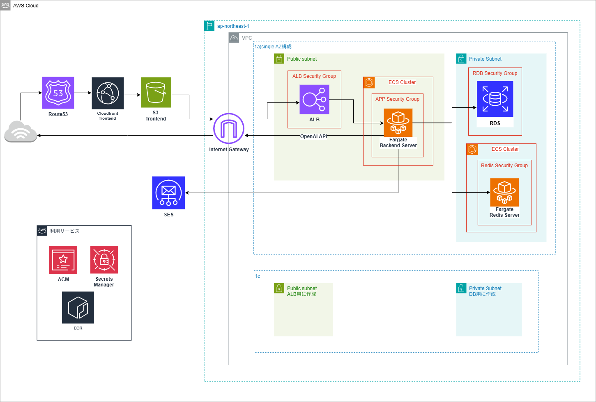

# billingrseとは

名前はbillingとparserを合わせた造語です。

Gmailから請求メールを取得し、AI解析を行ったうえで保存し、請求を検索・集計できます。  
※本リポジトリは`billingrse`の`IaCリポジトリ`です  
非構造なメール本文を、あとから追跡できる請求データへ変換するためのインフラ構成を管理することを目的にしています。

- 非構造メールを請求データへ変換するサービス基盤を管理
- stage分離で責務を明確化
- remote stateでTerraformの適用単位を分離

## このプロジェクトが解く課題

本プロジェクトは下記課題を解決し、
複数メールサービス・複数アカウントの請求メールを集計・確認するソリューションを支えるインフラを提供します。

- SaaSや各種支払いに関するメールは受信箱に散在しやすく、あとから検索・集計・重複確認しづらい
- 複数メールサービス・複数アカウントにまたがって情報を集約するのが難しい
- メール本文は非構造データなので、そのままでは請求一覧や月次比較に使いづらい
- AI解析だけでは業務データとして不十分で、支払先の正規化、請求成立判定、監査可能な履歴設計が別途必要になる

## 構成図


## リクエストフロー

- ユーザーアクセス → CloudFront/S3 → ALB → ECS → RDS/Redis

## CI/CDフロー

- GitHub Actions → OIDC → ECR push → ECS deploy

## 設計判断

このリポジトリでは、`dev` 環境の学習/検証用途であることを前提にしつつ、
将来の本番運用へ寄せやすい構成を意識して判断しています。

### 特に効いたもの

- stage分離（`network` / `application` / `domain` 等）と remote state 参照で、適用単位を明確に分離した  
  未使用時は stack 単位で削除しやすく、個人運用でもコストを継続的に抑えやすくなりました。
- CI（`push`）と Deploy（`workflow_dispatch`）を分離した  
  `main` 中心運用でも、変更検証と反映タイミングを切り離せるため、誤デプロイのリスク低減に効いています。
- backend の `test -> push -> deploy` を一体化した  
  テスト通過を反映の前提にすることで、未検証イメージの混入を防ぎやすくしています。
- ECS Fargate + Docker ベースに寄せた  
  ローカルとデプロイ先の実行差分を減らし、AMI管理を持たないことで運用認知負荷を下げています。

### 重視したもの

- 責務分離をディレクトリ構造で表現する  
  `stage` は環境単位、`module` は再利用単位、`resource` は役割単位として整理し、変更影響範囲を追いやすくしています。
- 共通値の管理ルールを明確にする  
  Git 管理してよい共通値は `const.tf` に寄せ、環境差分は `variables.tf` から入力して切り替える方針です。
- セキュリティ境界を明示する  
  app への inbound は ALB 経由に限定し、DB/Redis は private subnet 配置として、公開面を絞る設計を優先しています。
- 将来の移行余地を残す  
  本番化する場合は Multi-AZ、NAT Gateway、ElastiCache を段階導入する前提で、構成自体は拡張しやすい形を意識しています。

### コスト起点で判断したもの

- NAT Gateway を見送り  
  `dev` では固定費を抑えることを優先し、app は public subnet + Security Group 最小化で運用しています。
- ElastiCache for Redis を見送り  
  学習/検証フェーズでは Redis を ECS Fargate で運用し、可用性よりコストと構成の単純さを優先しています。
- Redis は永続化なしを採用  
  キャッシュ用途として割り切り、障害時の再構築コストより月額コスト削減を優先しています。
- RDS は削除保護をオフに設定  
  未使用時に destroy しやすくし、必要時のみ final snapshot を取得する運用でコストを調整しています。
- 見直し条件  
  本番運用へ移行する段階で、Multi-AZ / NAT Gateway / ElastiCache の採用を前提に再設計します。

## 技術スタック

- IaC: Terraform `>= 1.6.0` (HCL)
- Terraform Provider: `hashicorp/aws` `6.25.0`
- State管理: Amazon S3（tfstate）, DynamoDB（state lock）
- AWS（ネットワーク）: VPC, Subnet, Route Table, Internet Gateway, Security Group
- AWS（アプリ実行）: ECS Fargate, Application Load Balancer, Amazon ECR
- AWS（データ）: Amazon RDS for MySQL, Redis（ECS Fargate運用）
- AWS（配信/名前解決）: S3, CloudFront（OAC）, Route53, ACM, Cloud Map（Private DNS）
- AWS（監視/権限）: CloudWatch Logs, IAM, GitHub OIDC（AssumeRole）
- CI/CD・運用ツール: GitHub Actions

## ディレクトリ構成

```text
.
├── modules/              stackから呼び出す再利用module群
│   ├── account/          IAM/OIDC/権限関連module
│   ├── application/      ECS/RDS/CloudFrontなどアプリ基盤module
│   ├── network/          VPC/Subnet/SG/ALBなどネットワークmodule
│   └── shared/           環境横断で使う共通module
├── stage/                環境・責務単位のTerraform実行ディレクトリ
│   ├── common/           全環境共通の定数module
│   │   ├── const.tf      アプリ名やリージョンなど共通定数
│   │   └── outputs.tf    他stack参照用の共通値出力
│   ├── {stage}/          環境別ディレクトリ（例: dev / stg / prod）
│   │   ├── const.tf      環境共通の定数（stage名など）
│   │   ├── outputs.tf    環境共通値の出力
│   │   ├── state_manage/ 当該環境のremote state基盤管理
│   │   ├── account/      当該環境のIAM/OIDC関連stack
│   │   ├── network/      当該環境のネットワークstack
│   │   └── application/  当該環境のアプリ実行基盤stack
│   └── shared/           環境横断で共有するstack
│       ├── domain/       Route53/ACMなどドメイン関連stack
│       └── state_manage/ shared用remote state基盤管理
└── ecr_image/            ECRにpushする補助イメージ定義
    ├── db_init/          DB初期化用イメージ（SQL含む）
    └── redis/            Redis用イメージ定義
```

### 補足
- `stage/common/const.tf` でリポジトリ共通の値を定義します。
- `stage/{stage}/const.tf` で環境ごとの共通値を定義します。
- 各 stack はこれらの値を参照してリソース名や設定値を組み立てます。

## 詳細ドキュメント
- ローカル環境構築: [./docs/VsCodeDevContainer.md](./docs/VsCodeDevContainer.md)
- デプロイ手順: [./docs/deployment.md](./docs/deployment.md)
- 技術スタック: [./docs/technology_stack.md](./docs/technology_stack.md)
- コーディング規約: [./docs/coding_rules.md](./docs/coding_rules.md)
- ディレクトリ構成: [./docs/architecture.md](./docs/architecture.md)

## 関連リポジトリ
- [backend](https://github.com/shrimptails-f/billingrse_backend)
- [frontend](https://github.com/shrimptails-f/billingrse_front)
